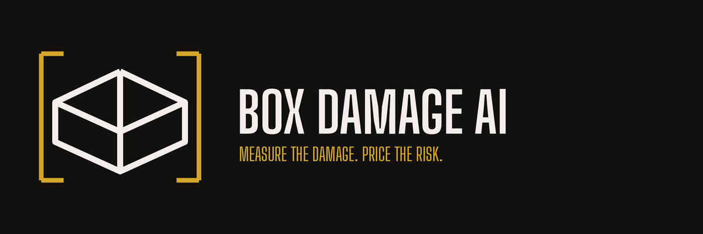

# Box Damage AI

AI system for detecting sneaker box damage and estimating resale-risk from photos.

**[⬇ Download the Android app (APK)](https://github.com/mkwon32-dev/resell-box-ai/releases/latest)** — install on any Android phone; no setup, everything runs on-device.

## Goal

Box Damage AI analyzes box damage from a user-uploaded photo and returns:

- damage type
- detected damage location
- estimated damage size
- risk level: `Low`, `Caution`, or `High`

This project is only a reference tool. It does **not** replace official resale inspection from platforms such as KREAM, StockX, or GOAT.

## Damage Types

We use three damage classes for object detection:

- `scratch`
- `dent`
- `tear`

`normal` images are used as negative examples with no bounding boxes.

## System Design

The system has three main parts:

1. **Roboflow / Object Detection**
   - Detects damage location with bounding boxes.
   - Classifies each detected damage as `scratch`, `dent`, or `tear`.

2. **OpenCV Damage Measurement**
   - If a reference card (8.56 × 5.398 cm) is in frame it is auto-detected
     and used for the most accurate px→cm scale.
   - Otherwise no reference object is needed: the box itself is the scale
     reference. OpenCV finds the box silhouette, splits it into visible face
     panels, and rectifies the damaged panel to fronto-parallel with a
     homography (this makes the measurement robust to weird camera angles).
   - Card-free damage is measured as a fraction of the panel, then converted
     to cm using a nominal sneaker-box length (33–37 cm; we assume 35 cm).
   - The app reports estimated damage dimensions and detected count.

3. **Rule-Based Risk Scoring**
   - Risk is calculated from damage type and longest measured side; the most
     severe detection wins. Area/count rules are planned but not implemented.
   - Risk is not manually labeled during training.

Example:

```text
tear + length >= 9 cm → High
small scratch → Low
medium dent → Caution
```

## Data Labeling Plan

Roboflow project type:

```text
Object Detection / Bounding Boxes
```

Labels:

```text
scratch
dent
tear
```

Labeling rules:

- Draw a bounding box around each visible damage.
- If one image has multiple damage types, label each damage separately.
- Normal images should have no bounding box.
- Do not label `risk_label` in Roboflow.
- Risk is calculated later using OpenCV measurements and rules.

## Size Estimation

A reference card in frame gives the best scale; without one, the box itself
is the scale reference — the user only has to keep the whole box in frame.

User instruction:

```text
Keep the whole box in frame. Optionally lay a credit-card-sized card
(8.56 × 5.398 cm) flat next to the damage for the most accurate sizing.
```

Measurement ladder (`DamageMeasurement.kt` for the card tier,
`BoxFaceMeasurement.kt` for the card-free tiers), from most to least
accurate — the card is auto-detected, no user toggle:

| Scene | Method | `scale_source` | Verdict behavior |
|---|---|---|---|
| Reference card found | card quad → homography → px/cm from known card dims | `card` | full cm rules |
| Box face found | face quad → homography → panel-relative → cm | `box_face` | full cm rules |
| Silhouette only | coarse scale: silhouette long edge = 35 cm | `box_edge` | full cm rules (coarse) |
| Close-up, no box edges | no size emitted | `none` | Caution floor |

The card tier wins when present because the card's dimensions are exactly
known, while the box tiers lean on a 33–37 cm length prior (about ±6% alone).
A card is only trustworthy when it is coplanar with the damage and detected
with high quality — low-quality card detections fall through to the box-face
tiers rather than poisoning the scale. For the card-free tiers, classical
face detection and assignment are the dominant error source: the current
synthetic benchmark has 37% median cross-face scale spread. Treat card-free
cm values as roughly ±30% estimates. Estimates are marked with `~`.

The cm thresholds below are equivalent to panel-relative fractions (at the
35 cm nominal): tear ≥ 9 cm ⇔ ≥ 0.26 of the panel's long dimension;
dent ≥ 12 / ≥ 4 cm ⇔ ≥ 0.34 / ≥ 0.11; scratch ≥ 10 cm ⇔ ≥ 0.29;
surface damage ≥ 8 cm ⇔ ≥ 0.23. Unmeasured damage (`none`) is floored at
`Caution` — it can never be cleared as `Low`.

### How the measurement math works

The photo contains no ruler, so every tier turns some object of *known
real-world size* into a px→cm conversion, then applies it to the detector's
damage bounding box. What differs per tier is which object supplies the
scale and how perspective distortion is removed.

**Card tier (`card`).** A credit-card-sized card has exactly known
dimensions (ISO/IEC 7810 ID-1: 8.56 × 5.398 cm). Detection: several
candidate generators (grayscale contours, Otsu regions, Hough-line quads,
and a saturation mask that isolates a whitish card on a colored lid even in
dim light) propose 4-corner quads, gated on *crispness* — near-perfect
rectangularity and solidity — rather than exact aspect ratio, because a
tilted card's apparent aspect drifts far from 1.586. The winning quad's four
corners define a homography (a perspective transform) onto the card's true
8.56 × 5.398 plane; the damage bbox is pushed through the same transform, so
its size lands directly in card-plane centimeters with tilt corrected. Two
safety nets follow: a *box-prior cross-check* (with the card's px/cm, the
visible box silhouette must come out 15–60 cm long — a "card" that implies
an 8 cm box is a mis-detected label or box face) and *user confirmation*
(the app outlines the detected card and asks; rejecting it swaps in the
card-free measurements computed in the same pass). On 299 dataset images
with no card, the gates + cross-check leave ~6% phantom proposals — each
costs one "No card" tap.

**Box-face tier (`box_face`).** No card → the box itself is the ruler,
via its nominal length (sneaker boxes run 33–37 cm; we assume 35).
Steps:

1. *Silhouette*: Canny edges → largest contour → convex hull (GrabCut
   fallback, color-checked against the background so flat close-ups fail).
2. *Face split*: a box seen at 3/4 angle projects to a hexagon. The interior
   corner where the three visible faces meet is recovered by parallelogram
   completion — each face is roughly a parallelogram in projection, so the
   hidden junction satisfies `p = v[i-1] + v[i+1] - v[i]` for alternating
   hull vertices. Three independent estimates of `p` must agree, which
   structurally validates the split into top/front/side quads.
3. *Face naming*: topmost centroid = top, largest remaining = front (long
   edge = 35 cm box length each); third = side (long edge = 25 cm width).
4. *Damage-to-face matching*: the damage bbox is intersected with each face
   polygon; only the overlap polygon on the winning face is measured, so a
   sliver of overlap cannot extrapolate off-panel and inflate the size.
5. *Rectification + conversion*: homography maps the face quad to an upright
   rectangle (undoing foreshortening), the overlap polygon is warped through
   it, and `px_per_cm = rectified_long_side_px / 35` (25 for the side face)
   converts its extent to cm.

**Box-edge tier (`box_edge`).** Silhouette found but no clean face split:
`minAreaRect` around the silhouette, its long edge is called 35 cm, and the
raw bbox is divided by that ratio. No perspective correction — coarsest
tier, gated to edge-sourced, box-shaped hulls only.

**`none`.** No box outline (close-up): no defensible px→cm conversion
exists, so no cm are emitted and risk floors at `Caution`.

Error budget: the 33–37 cm prior alone is ±6%; face misassignment (side
taken as front → 25 vs 35 mixup) and imperfect face splits dominate beyond
that, hence the ±30% guidance for card-free values. The card tier avoids
the prior entirely — its main failure mode is placement: a card lying on
thick white print (e.g. centered on the logo) fuses with it in every
channel and cannot be segmented; a few cm onto a plain area fixes it.

## 5-Week Schedule

### Week 1: Scope, Dataset Setup, and Labeling Rules

- Finalize project direction: object detection + OpenCV size estimation.
- Define damage classes: `scratch`, `dent`, or `tear`.
- Treat `normal` as no-bbox negative examples.
- Create Roboflow project.
- Filter collected images and remove unclear examples.
- Start manual labeling for clear examples.

### Week 2: Data Labeling and Baseline Model

- Label damage regions with bounding boxes.
- Include multiple damage boxes if one image has multiple defects.
- Train the first baseline model.
- Check confusion matrix and weak classes.
- Add or clean data based on early model results.

### Week 3: OpenCV Measurement Module

- Implement box-silhouette + face-quad detection with OpenCV.
- Rectify the damaged panel with a homography; convert panel fraction to cm
  via the nominal box length.
- Use detected damage bbox to estimate length and area.
- Add simple image quality checks:
  - blur
  - brightness
  - visibility

### Week 4: Risk Scoring and Prototype

- Build rule-based risk scoring.
- Combine:
  - damage type
  - bbox count
  - estimated length
  - estimated area
- Create simple app/demo interface.
- Show result:
  - damage type
  - size estimate
  - risk level
  - short explanation

### Week 5: Testing, Edge Deployment, and Presentation

- Test with real sneaker box images.
- Convert model to mobile-friendly format if possible.
- Test inference speed on Galaxy S25 or a local/mobile demo.
- Prepare demo examples for `Low`, `Caution`, and `High`.
- Summarize limitations:
  - not official inspection
  - limited dataset
  - sizes are estimates from typical box dimensions (33–37 cm), shown with `~`
  - close-up photos without box edges are unsized and floored at `Caution`
  - model may struggle with unclear or mixed damage

## Final Output Example

```text
Damage Type: tear
Detected Count: 1
Estimated Length: 10.2 cm
Risk Level: High
Reason: Large tear detected over the high-risk length threshold.
```

## Tech Stack

- Roboflow for annotation and dataset management
- Object detection model such as YOLO or Roboflow Train
- OpenCV for box-face detection, homography rectification, and size estimation
- Rule-based Python or JavaScript logic for risk scoring
- TensorFlow Lite or another mobile-friendly model format for edge deployment
